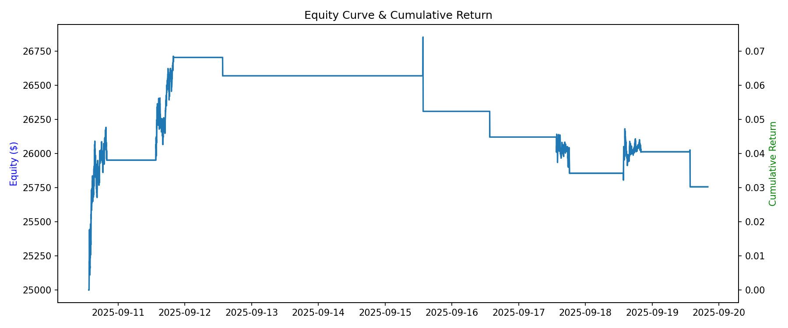

# Opening Range Breakout – First Intraday Strategy

This project is my **first attempt at building an intraday trading strategy**.  
The main goal is to practice **Git/GitHub** and get hands-on experience with **quantitative finance in Python**.

---

## Strategy
- Define the first 5 minutes after market open as the *opening range*  
- If price > daily open → go **long**  
- If price < daily open → go **short**  
- Stop-loss = opposite side of the range  
- Take-profit = 10 × risk distance  
- Close all positions before market close

---

## How to Run
1. Clone the repo and move into the folder  
   ```bash
   git clone https://github.com/melkerliljegren/opening-range-breakout.git
   cd opening-range-breakout
   
2. Install required Python packages
   ```bash
   pip install -r requirements.txt
   
3. Open the `.ipynb` notebook file in VS Code and run the cells.

  
---
   
## Results

The Opening Range Breakout strategy was backtested on Apple (AAPL) data.  
The plot below shows both the **equity curve** (left axis) and the **cumulative return** (right axis) over the test period.


